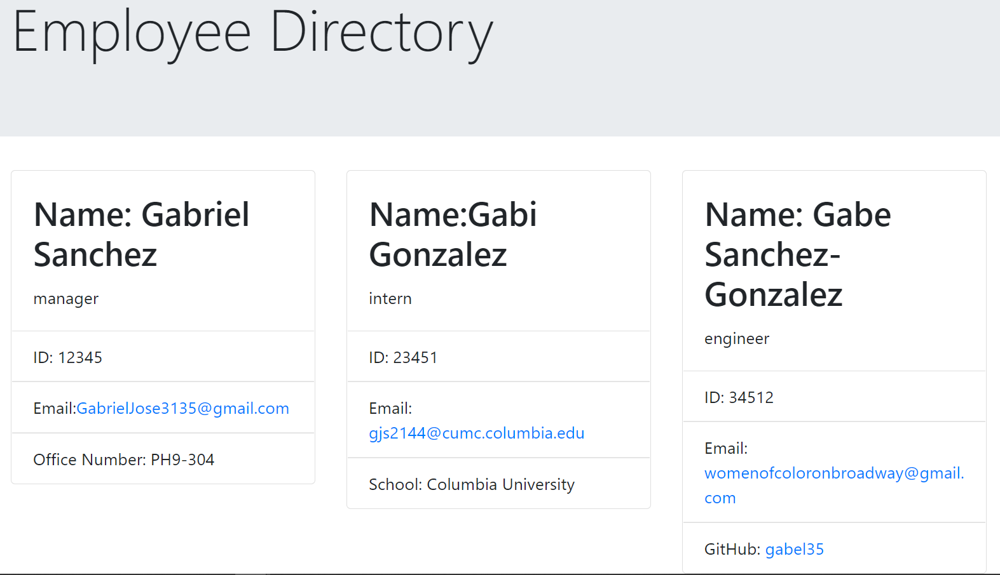

# teamGen Employee Directory

## Description

This app allows you to create a database of your employees and then generates a directory of those employees.

## Table of Contents

* [Installation](#installation)
* [Usage](#usage)
* [Credits](#credits)
* [Contributing](#contributing)
* [License](#license)
* [Questions](#questions)

## Installation

Run npm install to install required packages

## Usage

Run `node index.js` to run the application in your terminal. Once starting the application, answer the questions to build your database. This will generate an html file in the dist folder, which provides a dashboard to the directory.

Please follow the following link to the application!

[DEMO Video](https://drive.google.com/file/d/1wewaRiOzjbcWrPqs0atLoNzLZYzX3DRo/view?usp=sharing)

## Credits

Thank you to the TAs in office hours for all your help and to the others students of BCS for answering my questions!

### Contributing

This code is open source for whoever would like to contribute.
        
        
### Licenses

    GNU GPLv3

    Copyright (C) 2021  

    This program is free software: you can redistribute it and/or modify
    it under the terms of the GNU General Public License as published by
    the Free Software Foundation, either version 3 of the License, or
    (at your option) any later version.

    This program is distributed in the hope that it will be useful,
    but WITHOUT ANY WARRANTY; without even the implied warranty of
    MERCHANTABILITY or FITNESS FOR A PARTICULAR PURPOSE.  See the
    GNU General Public License for more details.

    You should have received a copy of the GNU General Public License
    along with this program.  If not, see <https://www.gnu.org/licenses>
    

### Questions

For any addiotional questions:

Feel free to email me!

github: [gabel35](https://github.com/gabel35)

email: GabrielJose3135@gmail.com
        

-------------

Thank you!
